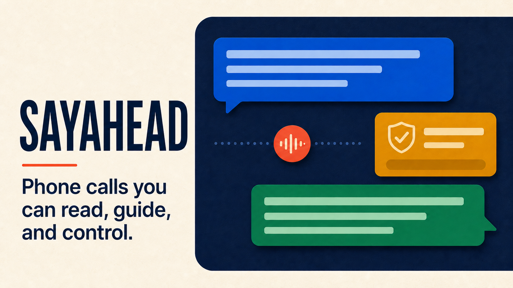
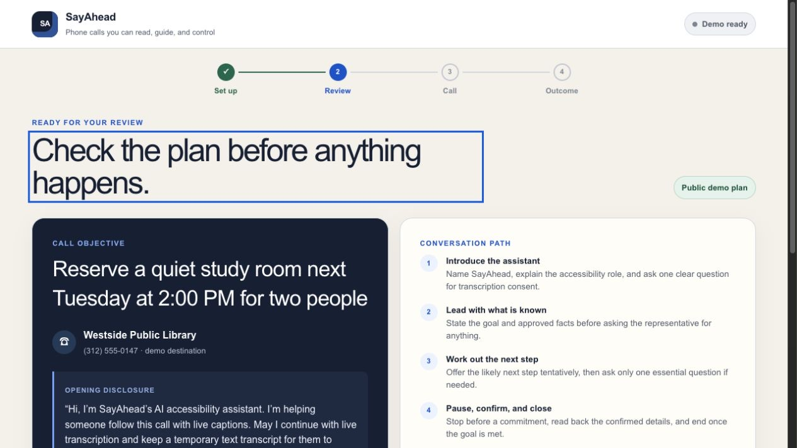
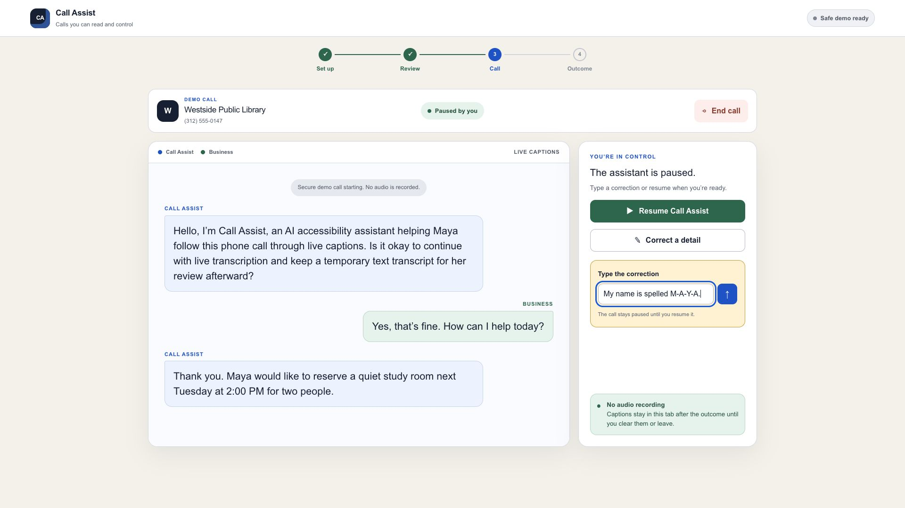
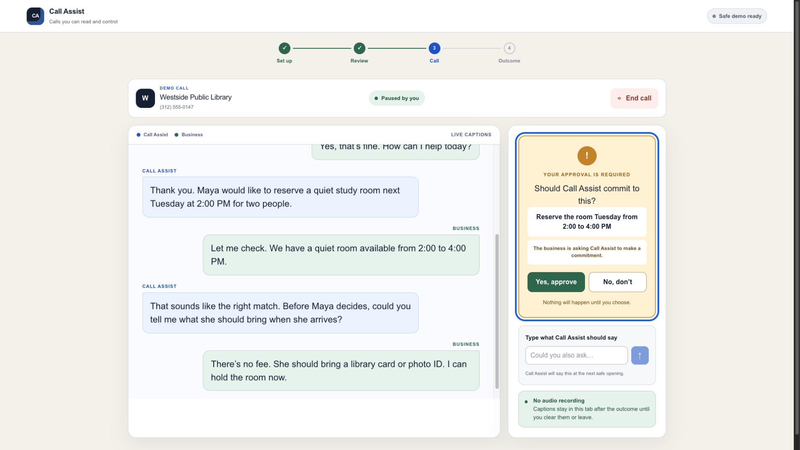
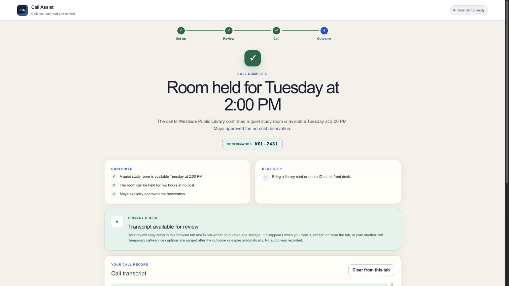

  

<h1 align="center">SayAhead</h1>

  <strong>Phone calls you can read, guide, and control.</strong> 
  A supervised, text-first calling assistant for Deaf and hard-of-hearing people. Plan the call, read large live captions, type what the assistant should say, and approve before it commits to anything.

  
  
  

  OpenAI Build Week · Apps for Your Life · GPT-5.6 Sol · OpenAI Realtime · Twilio

Many businesses still require a phone call for ordinary tasks. SayAhead lets the user decide the goal, what the assistant may share, and where it must stop. It creates a plan for review, handles the conversation with large two-speaker captions, and asks before the assistant makes a supported reservation, appointment, registration, or cancellation.

> **The public demo needs no credentials.** It uses a clearly labeled simulation, so no librarian receives a surprise demo call. The private, allowlisted path uses Twilio and OpenAI Realtime for real outbound calls.

## See the supervised flow

<table>
  <tr>
    <td width="50%" valign="top">
      
       <strong>1. Review before anything happens</strong> 
      With credentials, GPT-5.6 Sol creates a plan limited by the user's facts and rules. The clearly labeled demo uses the same plan format.
    </td>
    <td width="50%" valign="top">
      
       <strong>2. Follow and correct the conversation</strong> 
      Large captions separate the SayAhead assistant from the person answering. The user can pause, correct a detail, type what to say, resume, or end the call.
    </td>
  </tr>
  <tr>
    <td width="50%" valign="top">
      
       <strong>3. Approve every commitment</strong> 
      The assistant pauses before any supported commitment. It can ask; only the user can say yes.
    </td>
    <td width="50%" valign="top">
      
       <strong>4. Review the result and transcript</strong> 
      The outcome shows confirmed details, a reference number, unanswered questions, and next steps. GPT-5.6 creates it when configured, and the transcript stays available in the current tab for review.
    </td>
  </tr>
</table>

## Judge quick test

You can test the full flow in about 90 seconds:

1. Open the [public demo](https://call-assist-accessible-calls.bearhuddleston.chatgpt.site/); the library-room request is prefilled.
2. Confirm the request is low risk, then choose **Create call plan** and watch the four visible planning phases.
3. Review the disclosure, conversation path, success criteria, and approval point, then choose **Start simulated call**.
4. Follow the two-speaker captions. Pause the SayAhead assistant, enter a correction or typed instruction, and resume.
5. Approve the no-cost reservation only when prompted, then review the structured outcome and transcript. Finish with **Clear from this tab**.

Both paths use the same plan and outcome formats, along with the same pause, correction, and approval controls. The demo simply skips the real phone call.

## Safety and privacy boundaries

| The user stays in control | The SayAhead assistant stays inside the boundary |
| --- | --- |
| Reviews the plan before starting | User-initiated, allowlisted, low-risk calls only |
| Sees an AI/accessibility disclosure and transcription-consent request | No emergency calls, telemarketing, bulk outreach, payments, or high-stakes medical/financial transactions |
| Can pause, correct, type guidance, decline, or hang up | No dynamic IVR/DTMF navigation in this MVP |
| Must approve supported commitments | No commitment outside the reviewed goal and approval gates |
| Can review and explicitly clear the transcript | SayAhead does not record or store audio; the review copy stays in the current browser tab and is not saved to an account or database |

## Built with Codex and GPT-5.6

I built SayAhead in Codex with GPT-5.6 during the July 2026 Build Week submission period. Codex helped me scaffold and refine the React interface, define shared call contracts, implement safety checks, connect Fastify, Twilio, and OpenAI Realtime, write tests, diagnose live-call friction, and prepare the public demo.

Codex wrote and tested a lot of code. I still made the product calls:

- Focus on Deaf and hard-of-hearing people completing ordinary phone-only tasks.
- Prefer synthesis and tentative low-risk inferences over interrogating the person answering.
- Require AI/accessibility disclosure, clear transcription consent, and explicit approval before commitments.
- Keep the MVP low risk and supervised; defer dynamic IVR/DTMF.
- Record no audio and keep the review transcript only in the current browser tab.
- Ship a transparent simulation so judges can test the complete experience without credentials or pressure on a real call recipient.

GPT-5.6 Sol is integrated through the OpenAI Responses API in two runtime steps:

1. Turn the reviewed request into a strict, reviewable call plan.
2. Turn the completed conversation into a structured post-call outcome.

Both use Zod-backed schemas. The deterministic demo fills those same contracts and labels its simulated planning phases honestly. See the [planning route](app/api/plan/route.ts), [outcome route](app/api/outcome/route.ts), [shared contracts](lib/contracts.ts), and [agent prompts](lib/prompts.ts).

## Architecture

~~~mermaid
flowchart LR
    U["User captions + controls"] --> W["React web app"]
    W --> P["Responses API GPT-5.6 Sol"]
    W --> S["Private Fastify service"]
    S --> T["Twilio outbound call + Media Stream"]
    T <--> R["OpenAI Realtime gpt-realtime-2.1"]
    S --> W
~~~

| Layer | Role | Technology |
| --- | --- | --- |
| Accessible web app | Setup, plan review, captions, controls, approvals, outcome | React 19, TypeScript, Next-compatible App Router, vinext |
| Planning and outcome | Strict structured reasoning before and after the call | OpenAI Responses API, GPT-5.6 Sol, Zod |
| Realtime voice | Low-latency spoken conversation | OpenAI Realtime API, Agents SDK Twilio transport |
| Telephony | Outbound call and bidirectional media bridge | Fastify, Twilio Voice, Media Streams, WebSockets |
| Public hosting | Credential-free simulated calling | OpenAI Sites, Cloudflare Worker-compatible build |

Provider credentials, raw audio frames, and provider payloads remain server-side. The browser receives only normalized call state, caption, approval, outcome, and error events.

## Run locally

Requirements: Node.js 22.13 or newer.

~~~bash
npm install
cp .env.example .env.local
npm run dev
~~~

Open the printed local URL. Demo mode is enabled by default and requires no API key or telephony credentials.

To use real GPT-5.6 planning and outcomes, set <code>CALL_ASSIST_DEMO_MODE=false</code> and add <code>OPENAI_API_KEY</code> to <code>.env.local</code>. Keys are read only on the server.

<strong>Run the optional allowlisted live-calling path</strong>

Fill the telephony values in <code>.env.local</code>, including a long random <code>CALL_ASSIST_SERVICE_TOKEN</code>, an HTTPS <code>TELEPHONY_PUBLIC_BASE_URL</code>, and a consented E.164 test number in <code>CALL_ASSIST_ALLOWLIST</code>.

~~~bash
npm run dev
npm run telephony:dev
~~~

Keep <code>TWILIO_VALIDATE_SIGNATURES=true</code> outside a local webhook harness. Do not place a live call until the destination is allowlisted and the operator is ready to supervise it. Read the [live-call runbook](docs/live-call-runbook.md) first.

## Verify

~~~bash
npm run typecheck
npm run lint
npm test
npm run build
npm run test:render
~~~

The current suite covers structured contracts, safety screening, prompt behavior, demo timing, live-event projection, provider failure handling, and rendered output.

## Documentation

- [Product brief](docs/project-brief.md)
- [Architecture and voice-model decision](docs/architecture.md)
- [Live-call runbook](docs/live-call-runbook.md)
- [Build Week submission checklist](docs/submission-checklist.md)
- [Demo storyboard and media QA](submission/sayahead-demo/storyboard.md)

## License

SayAhead is available under the [MIT License](LICENSE). Third-party dependencies and services retain their respective licenses and terms.
